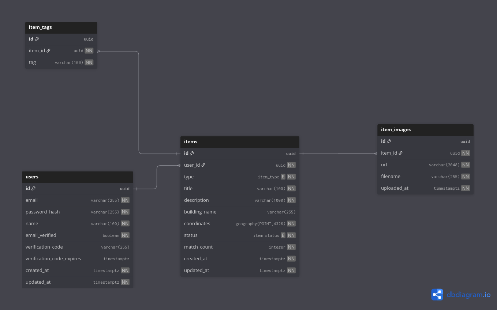

# LostLink - System Architecture

**Version:** 1.0  
**Last Updated:** December 4, 2025  
**Status:** MVP Development

---

## Table of Contents

1. [System Overview](#system-overview)
2. [High-Level Architecture](#high-level-architecture)
3. [Technology Stack](#technology-stack)
4. [Backend Architecture](#backend-architecture)
5. [Database Architecture](#database-architecture)
6. [Frontend Architecture](#frontend-architecture)
7. [API Design](#api-design)
8. [Storage Architecture](#storage-architecture)
9. [Security Architecture](#security-architecture)
10. [Deployment Architecture](#deployment-architecture)

---

## System Overview

LostLink is a smart lost & found platform designed for Hochschule Darmstadt. The system enables students to report lost or found items, with automated matching capabilities, real-time communication, and campus map integration.

### Core Capabilities

- **User Management:** University email-based authentication with email verification
- **Item Management:** Create, search, and manage lost/found items with images
- **Smart Matching:** Automated matching based on text similarity and location proximity
- **Real-Time Communication:** WebSocket-based chat for match verification
- **Storage:** S3-compatible object storage for item images
- **Geospatial Queries:** PostGIS integration for location-based features

---

## High-Level Architecture

### System Diagram

```
┌─────────────┐         ┌──────────────────┐         ┌─────────────┐
│   React     │◄──────► │   Node.js API    │◄──────► │  PostgreSQL │
│   Frontend  │         │   (Express)      │         │    Neon     │
│             │         │                  │         └─────────────┘
│  - Vite     │         │  REST + WebSocket│
│  - Tailwind │         │                  │         ┌─────────────┐
│  - Leaflet  │         │  Services:       │◄──────► │   MinIO     │
│             │         │  - Auth          │         │   (S3 API)  │
└─────────────┘         │  - Items         │         └─────────────┘
      ▲                 │  - Storage       │
      │                 │                  │
      │ Socket.IO       │  ORM: Drizzle    │
      └─────────────────│                  │
                        └──────────────────┘
```

### Architecture Principles

1. **Type Safety:** End-to-end TypeScript across frontend and backend
2. **Relational Database:** PostgreSQL with Drizzle ORM for type-safe queries
3. **REST + WebSocket:** RESTful API for CRUD, WebSocket for real-time features
4. **Stateless Backend:** JWT-based authentication, horizontally scalable
5. **Containerized Development:** Docker Compose for local development
6. **Cloud-Native:** Neon (serverless PostgreSQL), MinIO/S3 for storage

---

## Technology Stack

### Backend

- **Runtime:** Node.js
- **Framework:** Express.js
- **Language:** TypeScript (strict mode)
- **ORM:** Drizzle ORM
- **Database:** PostgreSQL 17 (Neon)
- **Storage:** MinIO (dev) / AWS S3 (production)
- **Authentication:** JWT + bcrypt
- **WebSocket:** Socket.IO
- **Documentation:** Swagger/OpenAPI

### Frontend

- **Framework:** React 19
- **Build Tool:** Vite
- **Language:** TypeScript
- **Styling:** Tailwind CSS
- **Routing:** React Router
- **Map Library:** Leaflet (planned)
- **State Management:** React Query (planned)

### Infrastructure

- **Database Hosting:** Neon (serverless PostgreSQL)
- **Storage:** MinIO (local) / AWS S3 (production)
- **Containerization:** Docker + Docker Compose
- **CI/CD:** GitHub Actions

---

## Backend Architecture

### Directory Structure

```
backend/
├── src/
│   ├── config/
│   │   ├── database.ts      # Drizzle database connection
│   │   ├── drizzle.ts       # Drizzle client setup
│   │   ├── env.ts           # Environment validation (Zod)
│   │   ├── minio.ts         # MinIO/S3 client
│   │   └── swagger.ts       # API documentation config
│   ├── db/
│   │   └── schema.ts        # Drizzle schema definitions
│   ├── middleware/
│   │   ├── auth.ts          # JWT authentication
│   │   ├── errorHandler.ts  # Global error handling
│   │   └── upload.ts        # Multer file upload
│   ├── routes/
│   │   ├── auth.ts          # Authentication endpoints
│   │   ├── items.ts         # Item CRUD endpoints
│   │   ├── health.routes.ts # Health check
│   │   └── index.ts         # Route registration
│   ├── services/
│   │   └── storage.service.ts # MinIO/S3 storage service
│   ├── types/
│   │   └── express.d.ts     # Express type extensions
│   ├── utils/
│   │   ├── logger.ts        # Winston logger
│   │   └── sendEmail.ts     # Email service
│   ├── websocket/
│   │   └── chatGateway.ts   # Socket.IO handlers
│   ├── app.ts               # Express app configuration
│   └── server.ts            # Server bootstrap
├── drizzle.config.ts        # Drizzle Kit configuration
└── package.json
```

### Key Components

#### Authentication Middleware
- JWT token verification
- User context injection (`req.user`)
- Protected route enforcement

#### Storage Service
- Abstract storage interface
- Supports MinIO (development) and AWS S3 (production)
- File upload, delete, and URL generation

#### Error Handling
- Centralized error handler
- Consistent error response format
- Logging integration

---

## Database Architecture

### Database Provider

**Neon** - Serverless PostgreSQL 17 with auto-scaling and branching capabilities.

### Schema Overview

See `docs/DATABASE.md` for detailed database documentation.

**Core Tables:**

1. **users** - User accounts with email verification
2. **items** - Lost/found items with geospatial data
3. **item_images** - Item images metadata (MinIO/S3 URLs)
4. **item_tags** - Item categorization tags

### Database Diagram



*Entity-Relationship Diagram showing the relational structure of the LostLink database.*

### Schema Design Principles

- **UUID Primary Keys:** All tables use UUID for globally unique identifiers
- **Foreign Key Constraints:** CASCADE deletes maintain referential integrity
- **Indexes:**
  - GIN indexes for full-text search
  - GIST indexes for geospatial queries (PostGIS)
  - Composite indexes for common query patterns
- **Automatic Timestamps:** Database triggers update `updated_at` automatically

### Database Extensions

- **uuid-ossp:** UUID generation
- **postgis:** Geospatial data types and functions

---

## Frontend Architecture

### Directory Structure

```
frontend/
├── src/
│   ├── pages/
│   │   ├── auth/
│   │   │   └── login/       # Login page
│   │   ├── Home.tsx         # Home page
│   │   └── navbar/          # Navigation component
│   ├── assets/              # Static assets
│   ├── App.tsx              # Root component
│   ├── main.tsx             # Entry point
│   └── index.css            # Global styles
├── public/                  # Public assets
└── vite.config.ts           # Vite configuration
```

### Current Implementation Status

**Implemented:**
- React 19 + Vite setup
- Basic routing structure
- Login page
- Home page with mock data
- Navbar component
- Tailwind CSS configuration

**Planned:**
- Item creation form
- Item listing with filters
- Map integration (Leaflet)
- Chat interface
- Notifications system

---

## API Design

### Base URL

- **Development:** `http://localhost:5000/api`
- **Production:** TBD

### Authentication

All protected endpoints require JWT token in `Authorization` header:

```
Authorization: Bearer <token>
```

### Endpoints Overview

See `docs/API_DOCS.md` for complete API documentation.

#### Authentication Endpoints

- `POST /api/auth/register` - Register new user
- `POST /api/auth/login` - User login
- `POST /api/auth/verify-code` - Email verification
- `GET /api/auth/me` - Get current user

#### Items Endpoints

- `POST /api/items` - Create lost/found item (with image upload)
- `GET /api/items` - List items (with filters: type, status, search, pagination)
- `GET /api/items/my` - Get current user's items
- `GET /api/items/:id` - Get single item details
- `PATCH /api/items/:id` - Update item (owner only)
- `DELETE /api/items/:id` - Delete item (owner only)
- `GET /api/items/images/:filename` - Serve image file

#### Health Check

- `GET /api/health` - Health check endpoint

### API Documentation

Swagger UI available at `/api-docs` (development mode).

---

## Storage Architecture

### Current Implementation

**Development:** MinIO (S3-compatible) running in Docker  
**Production:** AWS S3 (planned migration)

### Storage Service

The `StorageService` class provides a unified interface:

```typescript
class StorageService {
  uploadFile(file: Express.Multer.File, folder: string): Promise<UploadResult>
  deleteFile(filename: string): Promise<void>
  fileExists(filename: string): Promise<boolean>
  getProxyUrl(filename: string): string
}
```

### File Storage

- **Location:** MinIO bucket `lostlink-items`
- **Structure:** `items/{timestamp}-{filename}`
- **Serving:** Proxy URLs via API (`/api/items/images/:filename`)
- **Future:** Presigned URLs for direct S3 access in production

### Image Handling

- **Upload:** Multer middleware (memory storage, 7MB max)
- **Validation:** Image type validation (jpg, png, webp, gif)
- **Storage:** S3-compatible object storage
- **Metadata:** Stored in `item_images` table with URL and filename

---

## Security Architecture

### Authentication

- **Method:** JWT (JSON Web Tokens)
- **Token Expiry:** 7 days
- **Password Hashing:** bcrypt (12 salt rounds)
- **Email Verification:** Required for account activation

### Authorization

- **Email Domain:** Restricted to `@stud.h-da.de`
- **Ownership Verification:** Users can only modify their own items
- **Middleware:** `authenticate` middleware protects routes

### Data Protection

- **Input Validation:** Zod schema validation
- **SQL Injection:** Prevented by Drizzle ORM parameterized queries
- **XSS Protection:** Input sanitization (planned)
- **CORS:** Configurable origins via environment variable

### Security Headers

- Helmet middleware for security headers
- HTTPS enforcement (production)
- Secure cookie flags (if implemented)

---

## Deployment Architecture

### Development Environment

**Docker Compose Setup:**

```yaml
services:
  backend:    # Express API (port 5000)
  frontend:   # React dev server (port 5173)
  minio:      # Object storage (ports 9000, 9001)
```

**Key Features:**
- Hot-reload for backend and frontend
- Source code mounted as volumes
- MinIO data persisted in Docker volume
- PostgreSQL hosted on Neon (cloud)

### Production Architecture (Planned)

```
┌─────────────┐
│   Vercel    │  ← Frontend (static hosting)
│  / Netlify  │
└─────────────┘
      │
      ▼
┌─────────────┐
│   Render    │  ← Backend API
│  / Railway  │
└─────────────┘
      │
      ├──► Neon (PostgreSQL)
      └──► AWS S3 (images)
```

### Environment Variables

**Backend:**
- `POSTGRESQL_URI` - Neon connection string
- `JWT_SECRET` - JWT signing key
- `MINIO_*` / `AWS_*` - Storage configuration
- `NODE_ENV` - Environment mode

**Frontend:**
- `VITE_API_URL` - Backend API URL
- `VITE_WS_URL` - WebSocket URL

---

## Data Flow

### Item Creation Flow

```
1. User submits form (frontend)
   ↓
2. Multipart form data with image
   ↓
3. Backend validates input (Zod)
   ↓
4. Upload image to MinIO/S3
   ↓
5. Database transaction:
   - Insert item record
   - Insert image metadata
   - Insert tags
   ↓
6. Return created item with image URL
```

### Authentication Flow

```
1. User submits credentials
   ↓
2. Backend validates email/password
   ↓
3. Generate JWT token
   ↓
4. Return token + user data
   ↓
5. Frontend stores token
   ↓
6. Include token in subsequent requests
```

---

## Performance Considerations

### Database Optimization

- **Indexes:** Strategic indexes on frequently queried columns
- **Query Optimization:** Drizzle relations eliminate N+1 queries
- **Connection Pooling:** PostgreSQL connection pool managed by `pg`
- **Full-Text Search:** GIN indexes for fast text search

### API Performance

- **Pagination:** All list endpoints support pagination
- **Filtering:** Server-side filtering reduces data transfer
- **Batch Operations:** Related data fetched in batches (tags, images)

### Caching Strategy (Future)

- Redis for session caching (planned)
- CDN for static assets (planned)
- Query result caching (planned)

---

## Scalability

### Horizontal Scaling

- **Stateless Backend:** Can run multiple instances
- **Database:** Neon auto-scales compute resources
- **Storage:** S3 scales automatically

### Vertical Scaling

- **Database:** Neon allows compute size adjustment
- **Backend:** Container resources can be increased

---

## Monitoring & Observability

### Current Implementation

- **Logging:** Winston logger with structured logging
- **Error Tracking:** Centralized error handler with logging

### Planned Enhancements

- Application performance monitoring (APM)
- Database query monitoring
- Error tracking service (Sentry)
- Uptime monitoring

---

## Migration History

### Database Migration

- **From:** MongoDB (initial implementation)
- **To:** PostgreSQL 17 with Drizzle ORM
- **Reason:** Clear relational structure, better data integrity
- **See:** `docs/ADR/ADR_002.MD` for migration decision

### Architecture Decisions

All major architecture decisions are documented in Architecture Decision Records (ADRs):

- `docs/ADR/ADR_001.MD` - Initial database choice (MongoDB)
- `docs/ADR/ADR_002.MD` - Migration to PostgreSQL

---

## Related Documentation

- **Database Details:** `docs/DATABASE.md`
- **API Documentation:** `docs/API_DOCS.md`
- **Deployment Guide:** `docs/DEPLOYMENT.md` (planned)
- **User Guide:** `docs/USER_GUIDE.md` (planned)
- **Project Plan:** `docs/PLAN.md`

---

## Future Enhancements

### Planned Features

1. **Smart Matching Algorithm:**
   - Text similarity (TF-IDF)
   - Location proximity (Haversine)
   - Automated match suggestions

2. **Real-Time Chat:**
   - WebSocket integration
   - Match verification through chat
   - Message persistence

3. **Notifications:**
   - In-app notifications
   - Email notifications
   - Push notifications (future)

4. **Map Integration:**
   - Leaflet map for campus view
   - Location picker
   - Geospatial clustering

5. **AWS S3 Migration:**
   - Production storage migration
   - Presigned URLs
   - CDN integration

---

**Last Updated:** December 4, 2025  
**Maintained by:** LostLink Development Team

