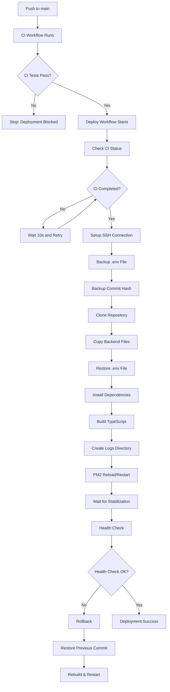

# Deployment Pipeline Documentation

**Last Updated:** January 15, 2026  
**Status:** Production

---

## Table of Contents

1. [Overview](#overview)
2. [Architecture](#architecture)
3. [Workflow Triggers](#workflow-triggers)
4. [Deployment Process](#deployment-process)
5. [CI/CD Integration](#cicd-integration)
6. [Error Handling & Rollback](#error-handling--rollback)
7. [Health Check Verification](#health-check-verification)
8. [PM2 Process Management](#pm2-process-management)
9. [Configuration](#configuration)
10. [Troubleshooting](#troubleshooting)
11. [Security Considerations](#security-considerations)

---

## Overview

The deployment pipeline automatically deploys the LostLink backend to an EC2 instance when code is pushed to the `main` branch. The pipeline ensures zero-downtime deployments, automatic rollback on failure, and comprehensive health checks.

### Key Features

- **Automatic Deployment**: Triggers on push to `main` branch
- **CI Gating**: Only deploys after CI tests pass
- **Zero-Downtime**: Uses PM2 reload for seamless updates
- **Automatic Rollback**: Reverts to previous version on failure
- **Health Checks**: Verifies deployment success before completion
- **Environment Preservation**: Automatically backs up and restores `.env` file

---

## Architecture

### Deployment Flow



### Workflow Files

- **`.github/workflows/ci.yml`**: Continuous Integration workflow
- **`.github/workflows/deploy.yml`**: Deployment workflow to EC2

---

## Workflow Triggers

### Automatic Trigger

The deployment workflow triggers automatically when:

- Code is pushed directly to the `main` branch
- CI workflow completes successfully

### Manual Trigger

The workflow can be manually triggered via GitHub Actions UI:

1. Go to **Actions** → **Deploy Backend to EC2**
2. Click **Run workflow**
3. Select branch (default: `main`)
4. Click **Run workflow**

### Trigger Conditions

- **Push to main**: Automatic deployment after CI passes
- **Manual dispatch**: Always available for testing or emergency deployments
- **CI Gating**: Deployment only proceeds if CI workflow passes

---

## Deployment Process

### Step-by-Step Breakdown

#### Job 1: Check CI Status

**Purpose**: Ensures CI workflow has passed before deploying

**Process**:

1. Polls GitHub API every 10 seconds for CI workflow status
2. Waits for CI workflow to complete (max 10 minutes)
3. Verifies CI conclusion is `success`
4. Fails deployment if CI failed or was cancelled

**Timeout**: 10 minutes maximum wait time

#### Job 2: Deploy Backend to EC2

**Step 1: Checkout Code**

- Checks out repository code to GitHub Actions runner

**Step 2: Configure SSH**

- Creates `~/.ssh` directory
- Saves SSH private key from secrets
- Sets proper permissions (600)
- Adds EC2 host to `known_hosts`

**Step 3: Test SSH Connection**

- Tests SSH connection with 10-second timeout
- Provides detailed error messages if connection fails
- Verifies all SSH configuration

**Step 4: Deploy to EC2**

Executes the following on EC2 via SSH:

1. **Backup `.env` File**

   - Copies `.env` to `.env.backup`
   - Preserves environment variables

2. **Backup Commit Hash**

   - Saves current commit hash to `.commit.backup`
   - Used for rollback if deployment fails

3. **Clone Repository**

   - Clones repository to temporary location (`/tmp/lostlink-repo-*`)
   - Uses GitHub token for authentication
   - Fetches latest code from `main` branch

4. **Clean Deployment Directory**

   - Removes existing files (except `.env`, `.env.backup`, `.commit.backup`, `node_modules`)
   - Ensures clean deployment state

5. **Copy Backend Files**

   - Copies only `backend/` folder contents to `/var/www/lostlink`
   - Preserves `.env` file (excluded from copy)
   - Uses `rsync` if available, falls back to `cp`

6. **Restore `.env` File**

   - Restores `.env` from backup
   - Ensures environment variables are preserved

7. **Install Dependencies**

   - Runs `npm ci --production=false`
   - Installs all dependencies including dev dependencies
   - Verifies `package-lock.json` integrity

8. **Build TypeScript**

   - Runs `npm run build`
   - Compiles TypeScript to JavaScript in `dist/` directory
   - Verifies build completes successfully

9. **Create Logs Directory**

   - Creates `/var/www/lostlink/logs` directory
   - Required for PM2 log files

10. **PM2 Process Management**
    - Checks if PM2 process exists
    - Deletes errored processes
    - Starts new process or reloads existing one
    - Uses zero-downtime reload when possible

**Step 5: Health Check Verification**

- Waits 15 seconds for server to stabilize
- Makes HTTP GET request to `/api/health` endpoint
- Verifies HTTP 200 status code
- Verifies JSON response contains `{ status: 'ok' }`
- Retries up to 5 times with exponential backoff:
  - Attempt 1: Immediate
  - Attempt 2: 10 seconds
  - Attempt 3: 20 seconds
  - Attempt 4: 40 seconds
  - Attempt 5: 80 seconds
  - Attempt 6: 160 seconds

**Step 6: Rollback on Failure**

If deployment or health check fails:

1. **Rollback on Deployment Failure**

   - Triggers when: Git pull, build, or PM2 fails
   - Restores previous commit from `.commit.backup`
   - Restores `.env` file from backup
   - Rebuilds application
   - Restarts PM2 process

2. **Rollback on Health Check Failure**
   - Triggers when: Deployment succeeds but health check fails
   - Same rollback process as above
   - Ensures system returns to working state

---

## CI/CD Integration

### CI Workflow (`ci.yml`)

The CI workflow runs before deployment and includes:

1. **Type Checking**: `npm run typecheck`
2. **Linting**: `npm run lint`
3. **Tests**: `npm test` (with PostgreSQL)
4. **Build**: `npm run build`
5. **Build Verification**: Checks that `dist/server.js` exists

### Deployment Gating

The deployment workflow:

1. **Waits for CI**: Polls CI status every 10 seconds
2. **Verifies Success**: Only proceeds if CI passed
3. **Blocks on Failure**: Fails immediately if CI failed
4. **Timeout Protection**: Fails after 10 minutes if CI doesn't complete

### Workflow Dependencies

```
Push to main
    ↓
CI Workflow (runs in parallel)
    ↓
Deploy Workflow (waits for CI)
    ↓
Check CI Status (verifies CI passed)
    ↓
Deploy to EC2 (only if CI passed)
```

---

## Error Handling & Rollback

### Error Detection

The workflow detects failures at multiple stages:

1. **SSH Connection Failure**

   - Fails immediately with detailed error message
   - Provides troubleshooting steps

2. **Git Operations Failure**

   - Git pull/clone failures trigger rollback
   - Network or authentication issues are caught

3. **Build Failure**

   - TypeScript compilation errors trigger rollback
   - Missing dependencies trigger rollback

4. **PM2 Failure**

   - Process start/reload failures trigger rollback
   - Application startup errors are caught

5. **Health Check Failure**
   - HTTP errors trigger rollback
   - Invalid responses trigger rollback

### Rollback Mechanism

#### Automatic Rollback

When a failure is detected:

1. **Identify Previous Commit**

   - Reads commit hash from `.commit.backup`
   - Falls back to `HEAD~1` if backup missing

2. **Restore Code**

   - Clones repository to temporary location
   - Checks out previous commit
   - Copies backend files from previous commit

3. **Restore Environment**

   - Restores `.env` file from `.env.backup`
   - Ensures configuration is preserved

4. **Rebuild & Restart**

   - Runs `npm ci` and `npm run build`
   - Restarts PM2 process
   - Verifies process is online

5. **Mark as Failed**
   - Workflow exits with error code
   - GitHub Actions shows failure status

#### Rollback Scenarios

| Scenario             | Trigger           | Rollback Action                 |
| -------------------- | ----------------- | ------------------------------- |
| Git pull fails       | Deployment step   | Restore previous commit         |
| Build fails          | Deployment step   | Restore previous commit         |
| PM2 fails            | Deployment step   | Restore previous commit         |
| Health check fails   | Health check step | Restore previous commit         |
| SSH connection fails | SSH step          | No rollback (fails immediately) |

---

## Health Check Verification

### Endpoint

- **URL**: `/api/health`
- **Method**: GET
- **Expected Response**:
  ```json
  {
    "status": "ok",
    "timestamp": "2026-01-15T19:32:39.144Z"
  }
  ```

### Verification Process

1. **Wait Period**: 15 seconds after PM2 reload
2. **HTTP Request**: GET request to health endpoint
3. **Status Check**: Verifies HTTP 200 status code
4. **Content Check**: Verifies JSON contains `"status":"ok"`
5. **Retry Logic**: Up to 5 retries with exponential backoff

### Retry Schedule

| Attempt | Delay | Total Wait Time |
| ------- | ----- | --------------- |
| 1       | 0s    | 15s             |
| 2       | 10s   | 25s             |
| 3       | 20s   | 45s             |
| 4       | 40s   | 85s             |
| 5       | 80s   | 165s            |
| 6       | 160s  | 325s            |

### Failure Handling

If health check fails after all retries:

- Triggers automatic rollback
- Restores previous working version
- Marks deployment as failed

---

## PM2 Process Management

### Process Configuration

- **Process Name**: `lostlink-backend`
- **Start Command**: `npm start` (runs `node dist/server.js`)
- **Mode**: Fork (single process)
- **Logs Directory**: `/var/www/lostlink/logs`

### Process Lifecycle

#### First Deployment

1. Checks if PM2 process exists
2. If not found, starts new process:
   ```bash
   pm2 start npm --name "lostlink-backend" -- start
   ```

#### Subsequent Deployments

1. Checks if process exists
2. If exists, attempts zero-downtime reload:
   ```bash
   pm2 reload lostlink-backend
   ```
3. If reload fails, falls back to restart:
   ```bash
   pm2 restart lostlink-backend
   ```

#### Error Recovery

- Detects errored processes
- Deletes errored processes before starting new one
- Ensures clean process state

### Zero-Downtime Deployment

**PM2 Reload** (`pm2 reload`):

- Sends SIGINT to current process
- Waits for graceful shutdown
- Starts new process with updated code
- Maintains active connections
- No service interruption

**PM2 Restart** (`pm2 restart`) - Fallback:

- Stops current process
- Starts new process
- Brief service interruption
- Used when reload fails

### Process Verification

After PM2 operation:

- Waits 2 seconds for process to stabilize
- Checks if process status is `online`
- Logs PM2 status if verification fails
- Continues deployment (with warning) if verification fails

---

## Configuration

### GitHub Secrets

The following secrets must be configured in GitHub repository settings:

| Secret Name           | Description                              | Example                              |
| --------------------- | ---------------------------------------- | ------------------------------------ |
| `EC2_SSH_PRIVATE_KEY` | Private SSH key for EC2 access           | Content of `~/.ssh/lostlink-key.pem` |
| `EC2_HOST`            | EC2 instance IP or hostname              | `52.28.207.198`                      |
| `EC2_USER`            | SSH username                             | `ubuntu`                             |
| `EC2_BACKEND_URL`     | Full backend API URL for health checks   | `https://lostlinkapi.duckdns.org`    |
| `EC2_BACKEND_PATH`    | (Optional) Backend directory path on EC2 | `/var/www/lostlink` (default)        |

### EC2 Prerequisites

Before first deployment, ensure EC2 instance has:

- **Node.js**: v18+ or v20+ installed
- **npm**: Installed with Node.js
- **PM2**: Installed globally (`npm install -g pm2`)
- **Git**: Installed (`sudo apt-get install git`)
- **Directory**: `/var/www/lostlink` exists (or configured path)
- **`.env` File**: Created with all required environment variables

### Environment Variables

The `.env` file on EC2 must contain:

**Required**:

- `POSTGRESQL_URI`: PostgreSQL connection string
- `JWT_SECRET`: JWT signing secret (min 16 characters)

**Recommended**:

- `NODE_ENV`: `production`
- `PORT`: `5000`
- `CORS_ORIGIN`: Frontend URL (e.g., `https://lostlink-alpha.vercel.app/`)

**Optional**:

- Storage configuration (MinIO or S3)
- SMTP configuration for emails

See `backend/src/config/env.ts` for complete list.

---

## Troubleshooting

### Common Issues

#### 1. SSH Connection Failure

**Error**: `Permission denied (publickey)`

**Solutions**:

- Verify `EC2_SSH_PRIVATE_KEY` includes `-----BEGIN` and `-----END` lines
- Check SSH key format (should be RSA or OpenSSH)
- Verify EC2 security group allows SSH from GitHub Actions IPs
- Test SSH connection manually: `ssh -i ~/.ssh/lostlink-key.pem ubuntu@52.28.207.198`

#### 2. PM2 Process in Errored State

**Error**: `PM2 process status: errored`

**Solutions**:

- Check PM2 logs: `pm2 logs lostlink-backend`
- Verify `.env` file exists and has correct values
- Check application logs: `cat /var/www/lostlink/logs/out.log`
- Manually test: `cd /var/www/lostlink && npm start`
- Ensure logs directory exists: `mkdir -p /var/www/lostlink/logs`

#### 3. Health Check Failing

**Error**: `Health check failed after 5 attempts`

**Solutions**:

- Verify backend URL is correct: `EC2_BACKEND_URL` secret
- Check if server is running: `pm2 status`
- Test health endpoint manually: `curl https://lostlinkapi.duckdns.org/api/health`
- Check application logs for errors
- Verify port 5000 is accessible (check security groups)

#### 4. Build Failures

**Error**: `ERROR: Build failed`

**Solutions**:

- Check TypeScript errors in CI workflow logs
- Verify all dependencies are installed
- Check `tsconfig.json` configuration
- Ensure `package.json` and `package-lock.json` are in sync

#### 5. Git Operations Failing

**Error**: `ERROR: Git pull failed`

**Solutions**:

- Verify GitHub token has repository access
- Check network connectivity on EC2
- Ensure repository is accessible
- Check for merge conflicts

### Debugging Commands

**On EC2**:

```bash
# Check PM2 status
pm2 status
pm2 logs lostlink-backend

# Check application logs
tail -f /var/www/lostlink/logs/out.log

# Test application manually
cd /var/www/lostlink
npm start

# Check if port is in use
sudo lsof -i :5000

# Verify environment variables
cat /var/www/lostlink/.env

# Check git status
cd /var/www/lostlink
git status
```

**In GitHub Actions**:

- View workflow logs in Actions tab
- Check each step's output
- Review error messages for specific failures

---

## Security Considerations

### SSH Key Security

- **Storage**: SSH private key stored in GitHub Secrets (encrypted)
- **Access**: Only repository admins can view/edit secrets
- **Logs**: Key values are automatically masked in workflow logs
- **Rotation**: Rotate SSH keys periodically

### Environment Variables

- **`.env` File**: Never committed to repository
- **Backup**: Automatically backed up before deployment
- **Restoration**: Automatically restored after git operations
- **Secrets**: Sensitive values stored in GitHub Secrets

### GitHub Token

- **Scope**: Limited to repository access
- **Usage**: Only for cloning repository
- **Automatic**: Provided by GitHub Actions (no manual setup)

### Network Security

- **SSH**: Uses private key authentication
- **Health Checks**: Uses HTTPS (if configured)
- **Firewall**: EC2 security group should restrict access

### Best Practices

1. **Regular Key Rotation**: Rotate SSH keys every 90 days
2. **Secret Auditing**: Regularly review who has access to secrets
3. **Least Privilege**: SSH key should have minimal required permissions
4. **Monitoring**: Monitor deployment logs for suspicious activity
5. **Backup**: Keep backups of `.env` file in secure location

---

## Workflow File Locations

- **CI Workflow**: `.github/workflows/ci.yml`
- **Deploy Workflow**: `.github/workflows/deploy.yml`

## Related Documentation

- [Architecture Documentation](ARCHITECTURE.md)
- [API Documentation](API_DOCS.md)
- [Database Documentation](DATABASE.md)
- [Testing Documentation](TESTING.md)

---

## Changelog

### Version 1.0 (January 15, 2026)

- Initial deployment pipeline implementation
- Zero-downtime deployment with PM2
- Automatic rollback mechanism
- Health check verification
- CI/CD integration
